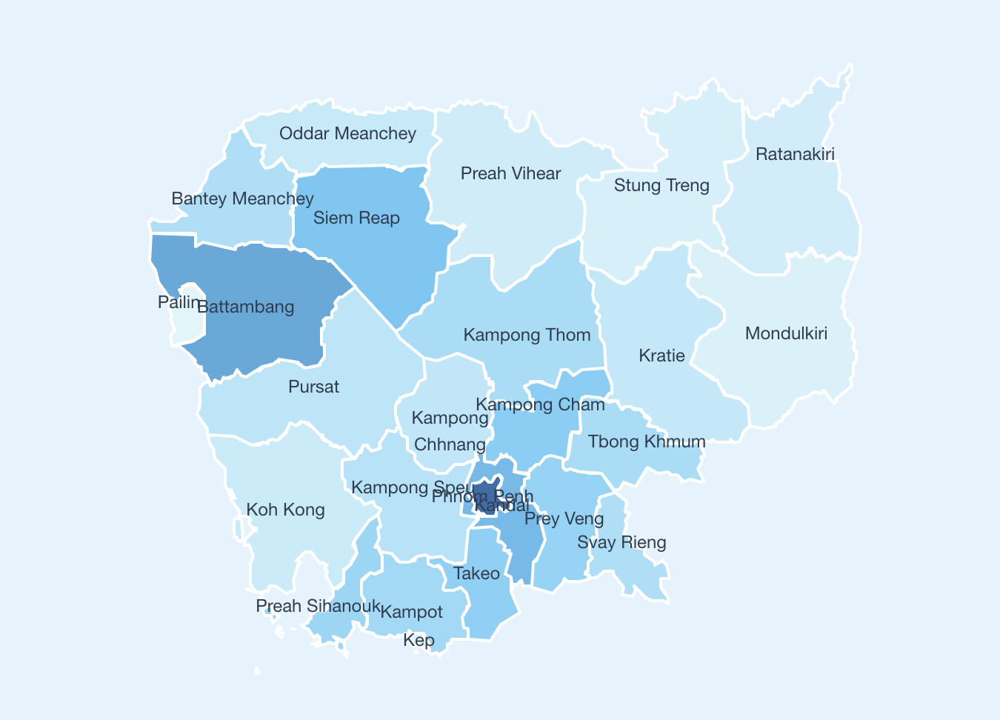

# Cambodia Loan Data Dashboard

A beautiful, interactive dashboard visualizing mock loan data by province for Cambodia, built with Vue 3, TypeScript, Vite, and Leaflet. The map uses a sky-blue heatmap to show total loans, with province labels, tooltips, and a detailed info panel.



## Features
- Interactive map of Cambodia's provinces (GeoJSON boundaries)
- Choropleth heatmap based on total loans (sky-blue palette)
- Province name labels on the map
- Hover tooltips with summary data
- Click for detailed info panel (loan breakdown, province metadata)
- Responsive, modern UI
- All data and code are open source

## Quick Start

```bash
# Install dependencies
npm install

# Run the development server
npm run dev

# Build for production
npm run build
```

## Folder Structure
- `src/components/MapDisplay.vue` — Main map dashboard component
- `src/lib/mockLoanData.ts` — Mock loan data for all provinces
- `src/assets/geoBoundaries-KHM-ADM1.geojson` — Cambodia province boundaries (GeoJSON)

## Data Sources & Credits
- Province boundaries: [geoBoundaries](https://www.geoboundaries.org/)
- Map rendering: [Leaflet](https://leafletjs.com/)
- Base code: Vue 3 + Vite + TypeScript

## License
MIT License. See [LICENSE](./LICENSE).

## Contributing
Pull requests and issues are welcome! Please open an issue to discuss major changes first.

---

*Made with ❤️ for open data and Cambodia.*
